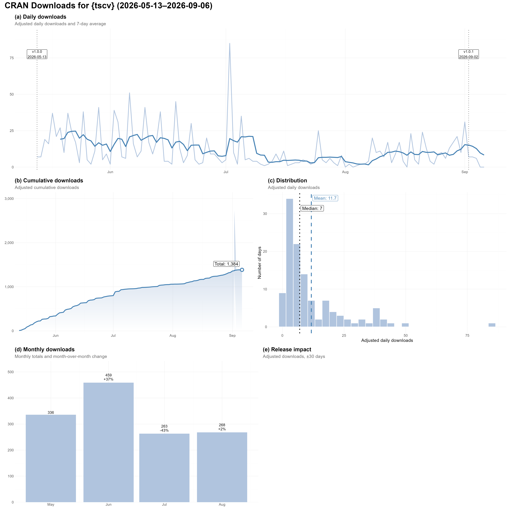

<!-- README.md is generated from README.Rmd. Please edit that file -->

# Download Statistics

Download statistics are based on the
[`adjustedcranlogs`](https://CRAN.R-project.org/package=adjustedcranlogs)
package rather than on raw CRAN download counts. The package uses data
from the RStudio CRAN mirror and adjusts the observed downloads for
systematic effects that can inflate raw counts, such as automated
CRAN-wide downloads and re-download spikes following package updates.

These adjustments provide a more representative indication of actual
package usage and make download trends easier to interpret. The
resulting statistics should nevertheless be understood as estimates
based on downloads recorded by the RStudio CRAN mirror rather than as
complete counts across all CRAN mirrors.

